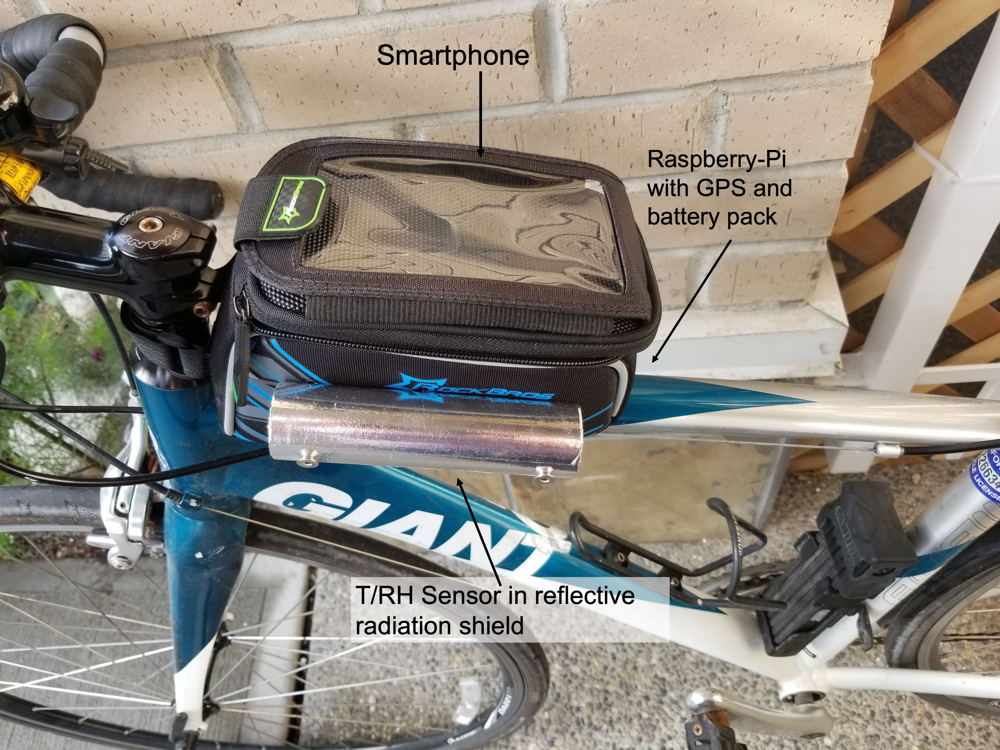

# Knox-Meteobike

This project is adapted from the work of [Dr. Andreas Christen](https://github.com/achristen/Meteobike) at the University of Freiburg. Here I present updates that I have made as part of GEOS 401 - Urban Meteorology which I teach at the University of British Columbia.

In GEOS 401, we will develop a similar system to measure, analyze and visualize the urban heat island effect. We will measure temperature and humidity transects across Vancouver and tag measurement locations with GPS. The system is battery operated and light, so it can be mounted on bikes. Communication with the Raspberry Pi Zero to our smartphone is enabled via wireless network.

{width=70%}
