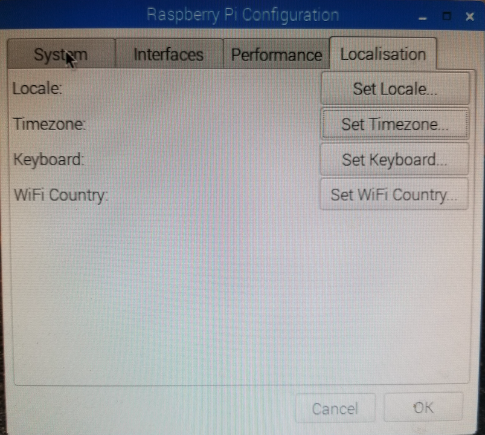

# Knox-Meteobike

This project is adapted from the work of [Dr. Andreas Christen](https://github.com/achristen/Meteobike) at the University of Freiburg. Here I present updates that I have made as part of GEOS 401 - Urban Meteorology, which I teach at the University of British Columbia.

In GEOS 401, we will develop a similar system to measure, analyze and visualize the urban heat island effect. We will measure temperature and humidity transects across Vancouver and tag measurement locations with GPS. The system is battery operated and light, so it can be mounted on bikes. Communication with the Raspberry Pi Zero to our smartphone is enabled via wireless network.

 

---
## 1. Overview
Each meteobike system is composed of the following components:

| Component                   | Model                                 | 
| ----------------------------|---------------------------------------|
| Microcontroller             | Raspberry Pi Zero W                   |
| GPS                         | Adafruit Ultimate GPS Breakout        |   
| Temperature/Humidity Sensor | DHT22 AM2302                          |    
| Micro SD Card               | NOOBS 16GB microSD                    |
| Battery                     | GETIHU Power Bank 10000 mAh*          |
| Jumper Wires                | Adafruit 'Extension' Jumper Wires*    |
* can be replaced with another product

<p align="center">

</p>

## 2. Connecting and starting the Raspberry Pi Zero
### Components of the Raspberry Pi Zero

The [Raspberry Pi Zero W](https://www.buyapi.ca/product/raspberry-pi-zero-w/) is a microcomputer running a full operating system and providing input and output connectivity through a number of interfaces:

<p align="center">

</p>

Your Raspberry Pi Zero W comes with a micro SD cards with the operating system (called [Raspbian](https://en.wikipedia.org/wiki/Raspbian)) preinstalled. Below is an image showing where the SD card is located on your Pi unit

<p align="center">

</p>

The first time you use your Raspberry Pi Zero W, you will need a few additional components (which are available in Rm 249). The components you need are:
<li>Screen (HDMI or VGA)</li>
<li>USB keyboard</li>
<li>USB mouse</li>
<li>A USB hub</li>
<li>Various interface cables</li>\

Note that after this initial set-up, you will be able to connect to the Pi directly with your phone (as outlined below).

To connect the screen during the initial set-up, connect the mini-HDMI cable to you screen (possibly using a HDMI to VGA adapter if your screen does not support HDMI and only VGA):

<p align="center">

</p>

Next, connect the USB ports. Your Raspberry Pi Zero W has two mini-USB ports, one (left) is for the USB devices (mouse, keyboard), one (right) is actually only for supplying power. First connect to the USB devices (left). This will vary by computer so let me know once you have reached this step and I will assist you if needed. Here is the set-up:

<p align="center">

</p>

Finally connect the battery to the right mini USB connector. The Raspberry Pi Zero W now starts up, the green indicator light begins to flash, and instructions follow on your screen.

### Deleting old files

If there are any CSV files on the desktop, go ahead and delete them.

### Updating the Timezone

If the time on your Raspberry Pi is incorrect, go to the applications menu (i.e. raspberry symbol), then go to Preference > Raspberry Pi Configuration. Under 'Localisation', click on 'Set Timezone' and make sure Areas is 'America' and Location is 'Vancouver'. Then click 'OK'. This should automatically update the time.

<p align="center">

</p>

### Changing the settings on your Raspberry Pi

First, change the Hostname to "raspberryXX" where XX is the unit number of your meteobike. To do this, click to open the applications menu (i.e. raspberry symbol), the go to:
Preference > Raspberry Pi Configuration > System.

Next, make changes to personalize your group's copy of `meteobike03.py` (you can double-click on `meteobike03.py` to open the file). Once the script is open:

* Replace "XX" on line 40 `raspberryid =` to your UNIT number. 
*	On line 41 change `studentname =` to UnitXX where XX is your Unit number.
	
Then save the modified code `File > Save` and close the file.

### Check the calibration coefficients 

Make sure your calibration coefficients in the python code match the values below. Open the file `Meteobike03.py` and change the following four lines (if needed):

```{}
temperature_cal_a1 = 1.00000
temperature_cal_a0 = 0.00000
vappress_cal_a1 = 1.00000 
vappress_cal_a0 = 0.00000 
```

Make sure you use a `.` and not a `,` as the delimiter if you need to change any of the calibration coefficients

Again, save the modified code `File > Save` and close the file.

## 3. Connecting the Raspberry Pi with your Smartphone

**Each team member should follow this step with their own phone**. Also, note that you will only need the monitor for the initial set-up, after that you can continue to connect to the Pi using your phone.

In a first step, enable your phone to host a Personal Hotspot. Although you do not need to access the Internet and you will not use any of your data plan capacity, this is required in order to build a network over WiFi to communicate between the Raspberry Pi and your Phone. However, *make sure you do not browse the web or download any files while connected to your Personal Hotspot (otherwise charges will apply to your data plan). Also make sure you use a personal, not the course password to protect your connection*.

Here is a description how to enable a personal hotspot on your [iOS smartphone](https://support.apple.com/en-us/HT204023)

Here is a description how to enable a personal hotspot on your [Android smartphone](https://support.google.com/android/answer/9059108?hl=en)

In both cases, you will now have a WiFi network enabled, and you can connect to the network from the Raspberry Pi Zero.

Boot the Raspberry Pi Zero, and then change the WiFi network to your Personal Hotspot WiFi name. To do so, first click in the menu-bar on the wireless network icon (red x's), then select **your Personal Hotspot WiFi name** 

<p align="center">

</p>

<p align="center">

</p>

Enter your password when prompted:

<p align="center">

</p>

**IF you get the error 'Invalid argument' after typing in your password, make sure to change the name of your device to avoid any unusual characters such as semicolons, commas, or colons.** To do this on an iOS device go to Settings > General > About. For an Android device, you can follow [these instructions](https://www.wikihow.tech/Change-the-Name-of-Your-Android-Phone).   

Then read the IP number (hover over the WiFi symbol in the menu bar to see it) e.g. `172.20.10.7` (*without the "/", and what comes afterwards*).

Next, on your smartphone install the "VNC Viewer" from "RealVNC":

<li>On iOS devices use the [Apple App Store to download the VNC Viewer](https://apps.apple.com/us/app/vnc-viewer/id352019548).</li>
<li>On Android devices use [Google Play to download the VNC Viewer](https://play.google.com/store/apps/details?id=com.realvnc.viewer.android).</li>

Once installed, start the VNC app. In the VNC app create a new connection and enter the local IP number you just read, e.g. `172.20.10.7` (without the "/", and what comes afterwards). When connecting **enter the username "pi"** and the raspberry pi password (**Geob401meteobike**). You should now be able to control your Raspberry Pi Zero as long as the phone and the raspberry are close together. Each time you log back on, you can use the same VNC session (remember to use your Hotspot).

When using the meteobike, you can put the phone into the transparent lid of the bag. You can also use the second outlet of the power bank to keep your phone charged during measurements, but in this case, you must bring your own charger-cable.

#### Dealing with a dynamic IP address 

Note that your Raspberry Pi may have a dynamic IP address, which means that the IP address you originally noted above changes. This means that you won't be able to connect to your meteobike next time you try to. Thankfully this is a pretty simple issue to resolve and you do not need to reconnect to an external monitor as you did during the initial set up. Just make sure to follow these steps each time you are unable to connect to your meteobike unit using the VNC (e.g., a **time out error**):

<li>Enable your phone to host a Personal Hotspot (as you did previously).</li>
<li>Once you've enabled the Hotspot, view the connected devices on your phone (as in the image below). Then click on 'rasberryXX", where XX is likely your unit number.</li>

<p align="center">

</p>

<li>Now you can view the new Raspberry Pi IP address (as in the figure below).</li>

<p align="center">

</p>

<li>Next connect to the VNC viewer, and clock on the information button as in the figure below.</li>

<p align="center">

</p>

<li>Next connect to the VNC viewer, and clock on the information button as in the figure below.</li>

<p align="center">

</p>

## 4. Running the recording interface

We want the data from the GPS and the temperature/humidity sensor to be automatically collected and written into a file. We would also benefit from having the system data displayed in real time on screen. This is done by double-clicking `meteobike.sh` and clicking 'Execute' to start the user interface. Here is an example:

<p align="center">

</p>

**Note that the recording will only start if you have a good GPS connection**. If the GPS is searching for a signal it will flash red 5 times in 10 seconds and if it flashes red once in 15 seconds it has been connected to the satellites. Also, note the 'Counter' should be highlighted in green as shown in the image above. 

## 5. Transferring data & display the recorded GPS track

The GPS track is stored by the Raspberry on the desktop as a comma-separated file. The file should look like this:

```{r, echo=FALSE}
meteobike_data = read.csv("15-Group15-2019-08-24-17-31-18 v2.csv")
meteobike_data_tbl <- meteobike_data[1:4, ]
```

```{r, echo=FALSE}
meteobike_data_tbl %>%
  kable() %>% 
  kable_styling(position = "center",latex_options = "hold_position") 
```

To transfer the files from your Pi to your phone, you can use an FTP client. Make sure you are using your Mobile Hotspot.

<li>For Android, I recommend [AndFTP](https://play.google.com/store/apps/details?id=lysesoft.andftp&hl=en).</li>
<li>For iOS devices you can use [FTPManager](https://apps.apple.com/ca/app/ftpmanager-ftp-sftp-client/id525959186).</li>

In all cases, the Hostname will be the IP address you noted above (and make sure to update it when the IP address of the Raspberry Pi changes as shown above). You will select SFTP (SSH File Transfer Protocol & use the default port). Username will be "pi" and the password is Geob401meteobike.

Alternatively, you can transfer files from your Pi to your computer using an FTP client. I recommend [FileZilla](https://filezilla-project.org/) for this. Clikc on 'Download FileZilla Client'. Again, make sure your computer is connected to your Mobile Hotspot (**but make sure to unsync all cloud storage deivces to make sure you don't use any data!**). Next, go to File >> Select entry. The click on 'New site'. Under Protocol, select 'SFTP - SSH File Transfer Protocol'. Under 'Host' enter the IP address you noted earlier (and used in your VNC Viewer, both of which may need to be updated as described previously). Under 'User' enter 'pi' the use the standard password (Geob401meteobike). Once you are connected, you will be able to transfer the files from your Raspberry Pi to your computer.

**Simple web-based visualization**
A first graphical representation of the track can be done place on the website http://www.gpsvisualizer.com/map_input

At top left choose "With: 1400", then at the top right under "Upload" choose your file and Click on Draw the map.

Color-coded drawing by temperature: Under "Track options" click on "advanced options" and make the following settings below:

```{}
Colorize by: custom field
Custom colorization field: temperature
Spectrum direction: down
Hue 1: 120
Hue 2: 0
```
Then click on Draw the map. Here is an example:

<p align="center">

</p>

This is just for a preliminary visualization of your data. For more complex analyses, please refer to the instructions for the Meteobike final report on Canvas.
